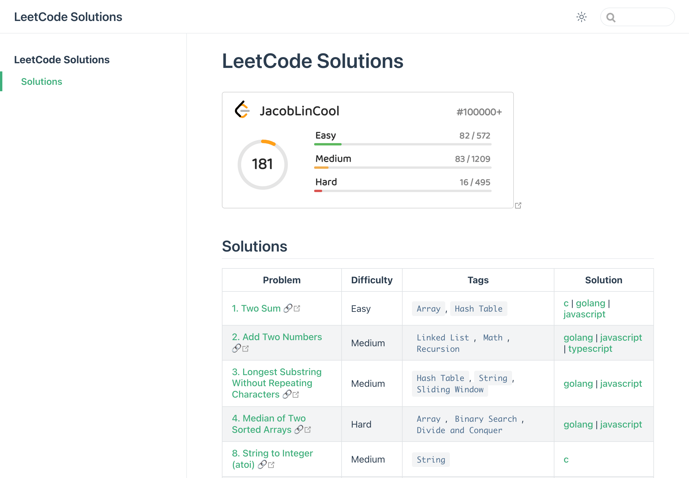
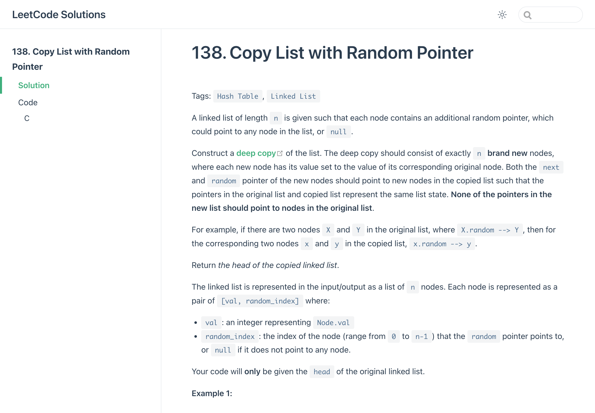
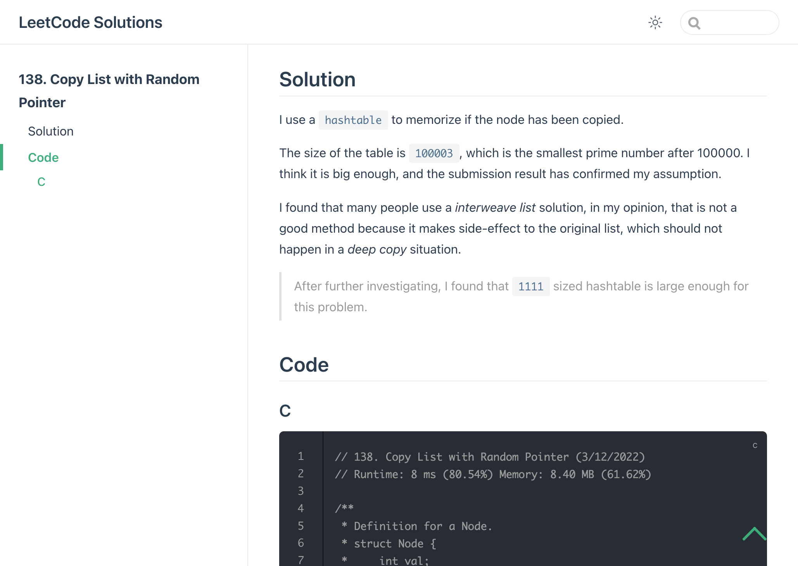
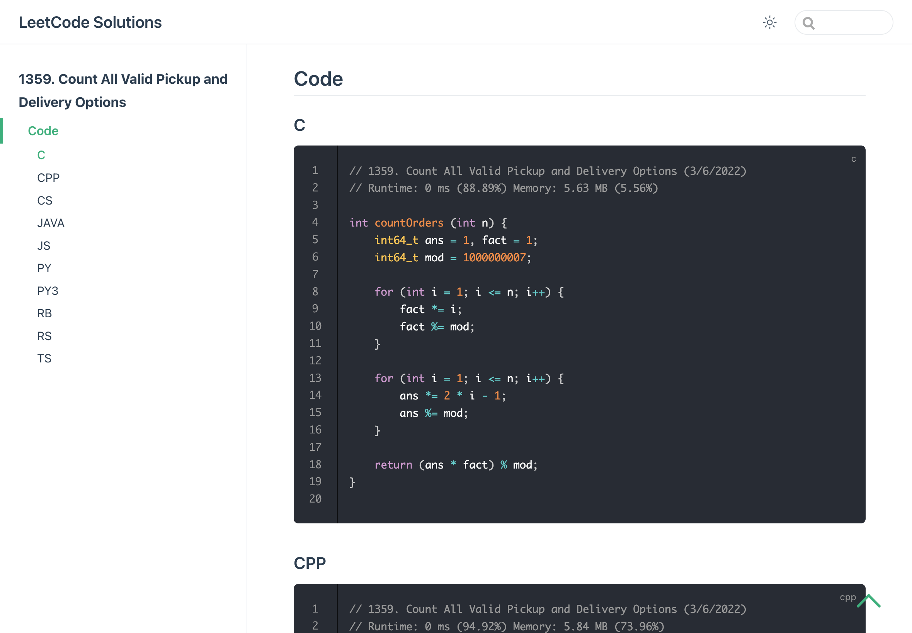
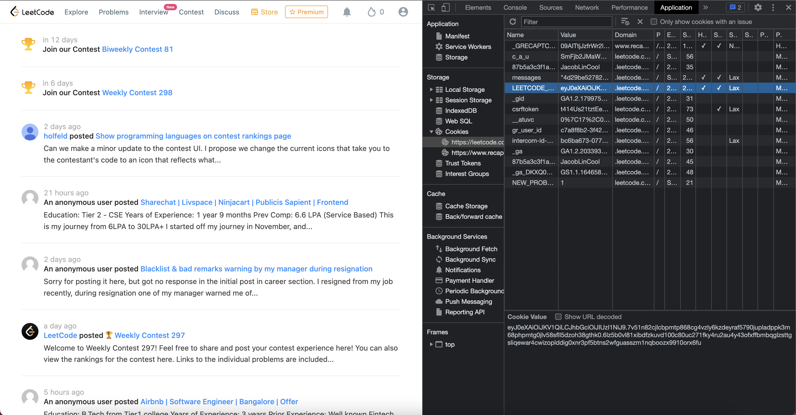

# LeetCode Dump

<p align="center">
  Dump your LeetCode solutions, and generate a static website to show them.
</p>

<p align="center">
  <a href="#install">Install</a> |
  <a href="#usage">Usage</a> |
  <a href="#github-action">GitHub Actions</a>
</p>

## Features

- Dump your LeetCode solutions in multiple languages.
  - Including code, note, runtime speed, memory usage, timestamp ...
- Generate a static website to show your solutions.
  - Index page, code highlight, search bar ...
  - See [screenshots](#screenshots) for more details.
- Easy to use.
  - Through `npx`, GitHub Actions, or Docker.
- Customizable.
  - You can use "template" `-T` to design what the website should look like.

## Install

You need Node.js 16+. Or [using Docker](#docker-usage).

```sh
npm i -g leetcode-dump
```

## Usage

### Dump Solutions

```sh
❯ leetcode-dump --help
Usage: leetcode-dump [options] [command]

Options:
  -V, --version              output the version number
  -s, --session <session>    Your LeetCode Session (default: "process.env.LEETCODE_SESSION")
  -o, --output <path>        Output Dir (default: "./leetcode")
  -c, --clean                Clear Output Dir Before Start (default: false)
  -l, --limit <rate>         Rate Limit <req>/<sec> (default: "20/10")
  -t, --timezone <timezone>  Your Timezone (default: "Asia/Taipei")
  -p, --pure                 Pure Mode, No Additional Informations to Add (default: false)
  -T, --template <path>      Template File for markdown index page
  -r, --retry <times>        Times to Retry When Fail (default: "3")
  -v, --verbose [bool]       Verbose Mode (default: true)
  -h, --help                 display help for command

Commands:
  build [options]            Build static site from dumped solutions
  transform [options]        Transform dumped solutions to a Vuepress source
```

Example:

```sh
leetcode-dump -s "eyJ0eXAiOiJKV1...AJFGlVhZ7f5QL8"
```

[How to get my session](#how-to-get-my-session)

### Build Static Site

This will use Vuepress to build a static site from solutions dumped by `leetcode-dump`.

```sh
❯ leetcode-dump build --help
Usage: leetcode-dump build [options]

Build static site from dumped solutions

Options:
  -s, --source <path>   Source Dir (default: "./leetcode")
  -o, --output <path>   Output Dir (default: "./site")
  -T, --template <path>  Template File for every document page
  -c, --config <path>   Vuepress Config Path
  -v, --verbose [bool]  Verbose Mode (default: true)
  -h, --help            display help for command
```

Example:

```sh
leetcode-dump build
```

### Generate Vuepress Content Source

This will generate a Vuepress content source from solutions dumped by `leetcode-dump`.

It is similar to `leetcode-dump build`, but you can do more things to customize the content source, then use Vuepress to build static site by yourself.

```sh
❯ leetcode-dump transform --help
Usage: leetcode-dump transform [options]

Transform dumped solutions to a Vuepress source

Options:
  -s, --source <path>   Source Dir (default: "./leetcode")
  -o, --output <path>   Output Dir (default: "./site-source")
  -T, --template <path>  Template File for every document page
  -v, --verbose [bool]  Verbose Mode (default: true)
  -h, --help            display help for command
```

Example:

```sh
leetcode-dump transform
```

### Note

If you install `leetcode-dump` globally, you can use `lcd`, the alias of `leetcode-dump`, as a command line tool.

## GitHub Action

[There is a Template, you can simply use it and setup in a minute.](https://github.com/JacobLinCool/LeetCode-Solutions-Template)

[Example Repository](https://github.com/JacobLinCool/LeetCode-Solutions)

## Docker Usage

The docker image is available on [Docker Hub](https://hub.docker.com/r/jacoblincool/leetcode-dump).

You can simply run it by using `docker run`:

```sh
# See Help
docker run --rm jacoblincool/leetcode-dump --help
# --rm: remove container after exit
```

```sh
# Dump Solutions and Notes
docker run --rm -v $(pwd)/leetcode:/leetcode jacoblincool/leetcode-dump -s "YOUR_LEETCODE_SESSION"
# --rm: remove container after exit
# -v: mount volume, {current directory}/leetcode (host) <-> /leetcode (container)
```

```sh
# Build Static Site
docker run --rm -v $(pwd)/leetcode:/leetcode -v $(pwd)/site:/site jacoblincool/leetcode-dump build
# --rm: remove container after exit
# -v: mount volumes:
#           {current directory}/leetcode (host) <-> /leetcode (container)
#           {current directory}/site (host) <-> /site (container)
```

You can simply change the mounted host volume to any location you want.

If you want to change the mounted container volume, you should also pass related options to `leetcode-dump`:

```sh
# Custom Mounted Volumes

docker run --rm -v $(pwd)/solutions:/lc/sol jacoblincool/leetcode-dump -s "YOUR_LEETCODE_SESSION" -o /lc/sol
# mount $(pwd)/solutions (host) <-> /lc/sol (container), use option "-o" to specify output dir (in container)

docker run --rm -v $(pwd):/lc jacoblincool/leetcode-dump build -s /lc/solutions -o /lc/site
# mount $(pwd) (host) <-> /lc (container), including "solutions" dir in previous step
# use option "-s" to specify source dir (in container) and "-o" to specify output dir (in container)
```

> You can add `-t` to `docker run` to enable more beautiful log.

## Screenshots









## How to Get My Session

Open dev tool, go to `application` tab, then find the cookie `LEETCODE_SESSION`, it's a JWT.


